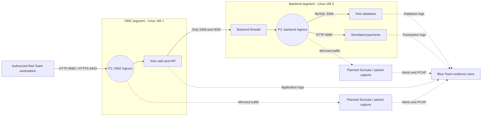

# Xein: diagrama de red y puntos de captura

Este diagrama describe la **topología objetivo del ejercicio**. Las máquinas y los sensores del Blue Team aún deben desplegarse en la red aislada. Las direcciones IP se asignarán antes de acordar las reglas de enfrentamiento.

| Punto | Tráfico que debe observarse | Uso previsto |
| --- | --- | --- |
| P1: entrada de DMZ | Peticiones del Red Team a la web en 8080 y 8443 | Captura de entrada, alertas de Suricata y correlación con los logs de la aplicación. El contenido HTTPS requiere logs de la web porque va cifrado en la red. |
| P2: enlace hacia Backend | Conexiones de la web a MySQL en 3306 y al simulador en 9090 | Captura de movimientos hacia datos y pagos, incluidos volumen, origen, destino y cronología. |

## Filtros preparados para la captura

La IP de cada equipo se sustituirá cuando el Blue Team configure las dos máquinas. Estos filtros sirven como punto de partida; se aplican en la interfaz que realmente ve cada enlace.

| Punto | Filtro de captura (BPF) | Filtro de visualización en Wireshark |
| --- | --- | --- |
| P1 | `tcp port 8080 or tcp port 8443` | `tcp.port == 8080 || tcp.port == 8443` |
| P2 | `tcp port 3306 or tcp port 9090` | `tcp.port == 3306 || tcp.port == 9090` |

Una captura de referencia debe registrar una petición normal a la web y una operación ficticia de pago antes de probar alertas. Para cada PCAP se anotarán hora UTC, interfaz, IP de origen y destino, filtro usado y archivo de logs relacionado. Hay que comprobar que el sensor de P2 ve las conexiones reales entre la web y el backend; el mero acceso a la web no demuestra que ese tráfico exista.

## Relación con el laboratorio local

`compose.yaml` reproduce las zonas `dmz` y `backend` con redes Docker. `web` está en ambas; `database` y `payment` están solo en `backend`. MySQL y pagos no publican puertos al ordenador anfitrión. Este montaje local permite probar los servicios, pero **no equivale todavía a las dos máquinas Linux** solicitadas en el informe al Blue Team.

## Configuración pendiente del Blue Team

1. Asignar IPs y reglas de firewall para que solo la web llegue a MySQL y pagos.
2. Colocar sensores y capturadores donde realmente vean P1 y P2; en Docker Desktop, capturar en la interfaz de Windows no garantiza ver el tráfico interno de Docker.
3. Definir reglas de Suricata, filtros de trabajo, salidas de alertas y conservación de PCAP y logs.
4. Sincronizar las máquinas y el almacén de evidencias con la misma fuente horaria.
5. Probar ambos puntos con eventos sintéticos antes de la ejecución del ataque.

## VM de entrega preparada el 6 de octubre de 2026

La variante construida usa Ubuntu Server 22.04.5 y tres contenedores en una VM. La red privada de acceso es `192.168.77.0/24`; la VM tiene `192.168.77.10` en `enp0s8`. La web publica `8080` y `8443` solo en esa IP. MySQL y pagos permanecen en la red Docker `backend`, sin puertos publicados.

Las capturas de referencia se realizaron con `enp0s8` conectada a una interfaz **solo anfitrión** de VirtualBox y Windows en `192.168.77.1`. La VM final y la imagen de entrega usan la red interna de VirtualBox **`xein-lab`**, que puede compartirse con las VMs autorizadas de Red y Blue en el mismo anfitrión. Su configuración debe adaptarse a la red aislada acordada antes del ejercicio. La interfaz `enp0s3` usa NAT para instalación, NTP y administración local; no es la interfaz del ejercicio. El reenvío NAT local permite abrir `https://localhost:18443/products` desde Windows.

| Punto | Interfaz en esta variante | Estado comprobado |
| --- | --- | --- |
| P1 | `enp0s8` de Ubuntu | Captura de las peticiones realizadas desde Windows a la web. |
| P2 | Puente Linux de la red Docker `xein-lab_backend` | Captura de consultas MySQL en 3306 y pagos internos en 9090. |

El nombre del puente P2 cambia si se recrea la red Docker. Se obtiene el identificador con `docker network inspect xein-lab_backend --format '{{.Id}}'`; la interfaz es `br-` seguida de sus primeros doce caracteres. Las capturas de referencia, sus registros y hashes están dentro de la VM en `/opt/xein/evidence`. Son pruebas sintéticas de preparación y no evidencias de la ejecución del ataque.

Estas pruebas confirman que ambos puntos permiten capturar tráfico. El despliegue de Suricata, sus reglas, el pipeline de alertas y la conservación de evidencias del ejercicio siguen pendientes del Blue Team. El montaje sigue siendo una variante de una VM; el informe inicial describe dos máquinas Linux.
