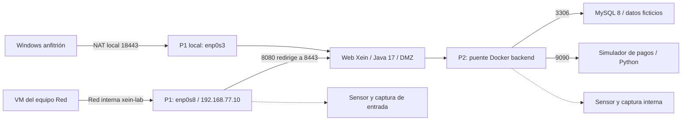

# Topología del laboratorio Xein

La entrega vigente sigue el informe de requisitos `-3`: **una VM Ubuntu Server 22.04.5 con tres contenedores**. Los documentos anteriores que hablaban de dos VMs quedan sustituidos por esta arquitectura.

| Segmento | Acceso | Función |
|---|---|---|
| Red interna VirtualBox `xein-lab` | VMs autorizadas en el mismo anfitrión | Ejercicio: servidor `192.168.77.10/24` |
| NAT de mantenimiento `enp0s3` | NTP, instalación y reenvíos locales | Acceso desde Windows; no publica la web en la LAN |
| Docker `dmz` | Contenedor web | Capa pública lógica |
| Docker `backend`, interna | Web, MySQL y pagos | Datos y pagos sin puertos publicados al exterior |

La separación DMZ/backend es lógica. MySQL y pagos comparten backend; no hay aislamiento entre ellos dentro de esa red. Una red interna de VirtualBox solo une VMs del mismo ordenador: para varios ordenadores hay que acordar otra red aislada, sus IPs y los adaptadores.

## Puntos de captura

| Punto | Interfaz real | Filtro de captura BPF | Filtro Wireshark |
|---|---|---|---|
| P1 del ejercicio | `enp0s8` | `tcp port 8080 or tcp port 8443` | `tcp.port == 8080 || tcp.port == 8443` |
| P1 de pruebas locales por NAT | `enp0s3` | Igual a P1 | Igual a P1 |
| P2 entre contenedores | Puente de `xein-lab_backend` | `tcp port 3306 or tcp port 9090` | `tcp.port == 3306 || tcp.port == 9090` |

El identificador del puente se obtiene con `docker network inspect xein-lab_backend --format '{{.Id}}'`; la interfaz es `br-` seguida de sus primeros doce caracteres. Puede cambiar al recrear la red. No basta capturar en Windows para observar el backend.

HTTPS cifra las rutas y los cuerpos de las peticiones. Las alertas de red se correlacionan con el log de acceso de Tomcat en `/var/log/xein/access` y el log de aplicación en `/var/log/xein/app.log`, dentro del contenedor web. MySQL guarda consultas en `/var/lib/mysql/general.log`; el simulador conserva transacciones en `/data/transactions.sqlite`. Todo usa UTC y comparte el reloj NTP de la VM.

## Entrega y fase 2

La OVA entrega servicios, datos iniciales y soporte de captura. El Blue Team decide sus defensas sobre su copia. El paquete defensivo y las evidencias de validación del Grupo N se guardan por separado de la entrega al otro equipo. Deben preservarse los registros y PCAP antes de que caduque su retención. La conectividad definitiva entre equipos se comprueba antes del ejercicio.
